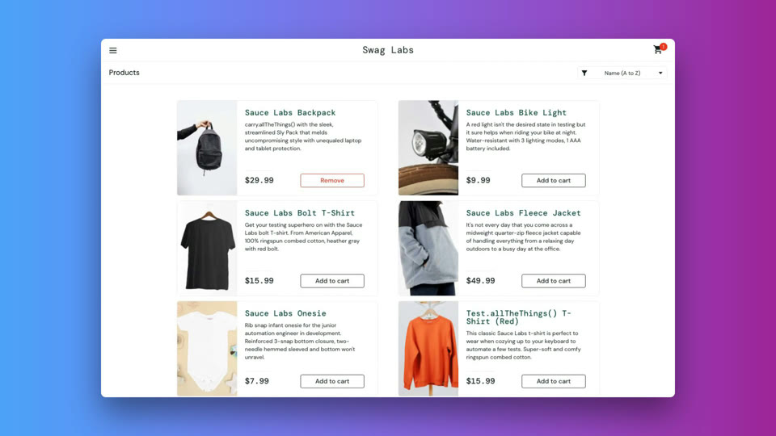

# demo-narrator-5000

Turns a plain-English "step list" into a narrated, branded demo video of your
*actual* product UI — no synthetic recreation, no manual screen recording.

Pipeline: **step list → TTS narration + timing → Playwright capture (paced to
narration) → Remotion composite (real footage + voiceover + music + captions) → MP4**

[](https://youtu.be/CtXkCjxnsFs)

## How it works

You provide a target URL, a list of actions to run against it (click here,
type this, scroll there), and a line of narration for each one describing
what's happening. From there:

1. **Narration comes first.** Each step's narration text is sent to OpenAI's
   TTS API, which generates a spoken audio clip for it. Every clip is timed
   — a five-second sentence gets a five-second budget — and those timings
   become the schedule the rest of the pipeline follows.
2. **Playwright drives the real app.** A headless Chromium browser opens
   your actual product — not a mockup or recreation — and performs each
   step for real (clicking, typing, scrolling, navigating) while recording
   the screen. Each action is paced to last as long as its narration clip,
   so a step with a longer explanation gets more on-screen dwell time and a
   quick aside gets less.
3. **Remotion assembles the final video.** The raw screen recording, the
   narration voiceover, optional background music, and captions (derived
   from the same narration timing) are composited together into one MP4.

The result is a narrated, captioned demo of your actual product, without
anyone manually recording a screen or hand-timing a voiceover to it.

## Prerequisites / setup checklist

- [ ] Node.js 18+
- [ ] `npm install` in this directory (installs Playwright, Remotion, ffmpeg wrapper, etc.)
- [ ] `npx playwright install chromium`
- [ ] `ffmpeg` installed and on PATH (`brew install ffmpeg` / `apt install ffmpeg`)
- [ ] Create your own `.env` file — run `cp .env.example .env`, then open
      **`.env`** (not `.env.example`) and paste in your real `OPENAI_API_KEY`.
      - **`.env.example` is committed to git; `.env` is not.** Never put a
        real key in `.env.example` — anything written there is public the
        moment you push. `scripts/tts.ts` will refuse to run and tell you
        what's wrong if you skip this step or edit the wrong file.
      - **Important:** OpenAI API billing is separate from any ChatGPT
        subscription. Even if you already pay for ChatGPT Plus/Team, you must
        add a payment method under **API billing** specifically at
        platform.openai.com/settings/organization/billing. If the TTS step
        fails with a billing/quota error, this is almost always why — check
        API billing, not your ChatGPT plan.
- [ ] Auth setup per environment (see `auth/README.md`) — one-time manual
      login per env (prod / staging) to capture a Playwright `storageState`
      file. These files contain live session cookies: keep them out of git
      (already covered by `.gitignore`) and treat them like credentials.

## Usage

```bash
# 0. (optional, free, instant) Preview the narration script before
#    spending anything on TTS/capture/render
npm run preview -- steps/example-flow.json

# 1. Generate narration audio + timing from a step list
npm run tts -- steps/example-flow.json

# 2. Capture the real UI, paced to match narration timing
npm run capture -- steps/example-flow.json --env staging

# 3. Composite: real footage + voiceover + music + captions -> final MP4
npm run render
```

`npm run preview` reads only the step list JSON — no OpenAI/Playwright/
Remotion calls — and prints each step's action + narration line with a
rough duration estimate, so you can sanity-check the whole script before
running anything that costs time or money.

Output lands in `output/final.mp4`.

**One demo at a time.** Every stage writes to fixed, unnamespaced paths
(`audio/`, `output/timing.json`, `output/raw-capture.webm`, `public/`,
`output/final.mp4`) regardless of which step-list file you ran. Starting a
second demo before moving `output/final.mp4` elsewhere will overwrite it —
or worse, mix one demo's audio with another's footage if you interleave
runs. Move/rename `output/final.mp4` out before starting the next demo. See
[ROADMAP.md](ROADMAP.md) for the planned per-demo namespacing fix.

## Step list format

Each entry in a `steps/*.json` file's `steps` array is one browser action.
`narration` is optional — omit it for silent/setup actions (the capture
still runs, it just doesn't get a caption or narration-length dwell time).
`postDelayMs` adds extra dwell time after the action, on top of whatever the
narration clip's length already provides.

| action   | fields                          | does |
|----------|----------------------------------|------|
| `goto`   | `path`                          | Navigate to `path`, resolved against the env's `baseUrl`. |
| `click`  | `selector`                      | Click the element matching `selector`. |
| `fill`   | `selector`, `value`             | Type `value` into the element matching `selector`. |
| `wait`   | `ms`                            | Pause for `ms` (default 500), no page interaction. |
| `waitFor` | `selector`, `timeoutMs` (optional), `required` (optional) | Wait for the element matching `selector` to become visible, up to `timeoutMs` (default 30000). Unlike `wait`, this moves on as soon as the condition is met instead of always burning the full duration — and by default it never throws: if the element doesn't show up in time, a warning is logged and the demo proceeds anyway. Set `required: true` for preconditions where proceeding without it would just produce a broken recording further downstream (e.g. confirming a login actually succeeded before continuing) — this aborts the capture immediately with a clear error instead of failing later with a confusing, unrelated-looking timeout. |
| `scroll` | `amount`, `x`, `y` (all optional) | Scroll the page by `amount` px (default 400) via a mouse wheel event at `(x, y)` — defaults to roughly the left-third of the viewport, useful for pages with independently-scrolling panels. |
| `hover`  | `selector`, `ms` (optional)      | Move the mouse over the element matching `selector` and dwell for `ms` (default 1000) — long enough for a CSS `:hover` transition (image zoom, tooltip, dropdown reveal) to actually play out on camera. |
| `select` | `selector`, `value`             | Choose an option in a `<select>` element matching `selector`, by option `value`. Unlike `fill`, which only works on `<input>`/`<textarea>`/`[contenteditable]` elements. |

`config/<env>.json`'s `storageStatePath` is optional — omit it (or leave it
`null`) for public pages that don't need a login session.

### Per-demo config (`meta`)

A step list's `meta` object can set config for that specific demo. These are
resolved once by `npm run tts` and written into `output/timing.json`, which
`capture.ts`, `prepare-assets.sh`, and the Remotion composition all read from
— so there's one place downstream steps look for "what this demo actually
asked for," instead of duplicated or hardcoded values that can drift out of
sync with each other.

| field        | fallback when omitted                              |
|--------------|-----------------------------------------------------|
| `env`        | the `--env` CLI flag, or `"staging"` if neither is set — see note below |
| `voice`      | `alloy` — any OpenAI TTS voice name |
| `viewport`   | the env's `config/<env>.json` viewport | 
| `musicPath`  | auto-detects a single `.mp3`/`.wav`/`.m4a` in `assets/`, or silence if none |
| `userAgent`  | the env's `config/<env>.json` `userAgent`, or a real desktop Chrome UA (built from the actual bundled Chromium version, not a hardcoded string) |
| `background` | a built-in dark gradient |
| `padding`    | `96` (px inset around the footage on the output canvas) |
| `cornerRadius` | `12` (px, on the footage's corners) |
| `shadow`     | `true` (drop shadow under the footage) |
| `captions`   | `false` — burned-in on-screen captions, timed off each step's narration window |
| `introTitle` / `introSubtitle` | no intro card — set `introTitle` to add one (subtitle is optional) |
| `outroTitle` / `outroSubtitle` | no outro card — set `outroTitle` to add one (subtitle is optional) |
| `introDurationSec` / `outroDurationSec` | `3` (seconds) — only applies if the matching card is shown |
| `logoPath`   | no logo — a path to an image file, shown above the title on both cards if set |

Unlike the rest of this table, `env` isn't resolved by `npm run tts` into
`output/timing.json` — it's read directly from the step list by
`npm run capture`, since which environment to load has to be known before
`capture.ts` can even find `config/<env>.json`. The `--env` CLI flag always
wins if passed; `meta.env` is only the default used when the flag is
omitted.

The final video is always rendered onto a fixed 1920x1080 canvas,
regardless of the captured viewport — the real footage is scaled (never
cropped) to fit inside that canvas minus `padding` on each side, so it
reads as a produced demo with room around it rather than a raw full-bleed
screen recording. `background` accepts three kinds of value: omitted (uses
the built-in gradient), a CSS color/gradient string (e.g. `"#101820"` or
`"linear-gradient(...)"`), or a path to an image file on disk, which gets
staged into the render behind the footage.

Viewport is a per-demo decision more than a per-environment one — the same
staging environment might back both a desktop demo and a phone-sized one —
so `meta.viewport` wins over the environment default when both are set.

`musicPath` has three distinct states, useful if `assets/` holds more than
one track (say, `chill.mp3` and `techno.mp3` for different demos):
- **omitted** — auto-detect a single track in `assets/`
- **set to a path**, e.g. `"assets/chill.mp3"` — use that exact file
- **set to `null`** — explicitly no music for this demo, silence, and
  skip auto-detection (so having other demos' tracks sitting in `assets/`
  doesn't accidentally pull one in)
`capture.ts` also writes back whichever viewport it actually used, so the
Remotion composition is always sized to match the real recording rather than
a value that has to be kept in sync by hand.

`introTitle`/`outroTitle` each independently gate a full-screen title card
(centered title + optional subtitle, fading in with a slight scale-up over
the card's first ~0.7s, then holding) shown before/after the captured demo
— setting one doesn't imply the other. Both share `logoPath` (an image
shown above the title on whichever card(s) are active) and default to a
3s hold, overridable per-card via `introDurationSec`/`outroDurationSec`.
Unlike `musicPath`, `logoPath` is explicit-path-only — it won't auto-detect
an image sitting in `assets/`, since accidentally picking the wrong image
as a logo is a lot more visible than picking the wrong background track.
Note that `title` (used only as a label in `npm run preview`'s header) is
a different field — `introTitle` does not fall back to it, so setting
`title` alone never adds an intro card.

By default Playwright's Chromium reports an automated/headless User-Agent,
which some target apps' client-side browser-detection flags as unsupported
mid-recording — set `meta.userAgent` (or `userAgent` in `config/<env>.json`
for an env-wide default) to override it with a specific UA string if the
built-in desktop Chrome default still gets flagged.

If a target app's browser detection still flags Playwright even with a
spoofed UA — some checks look past the UA string at engine-level signals
that only real Chrome has — set `browserChannel: "chrome"` in that env's
`config/<env>.json` to make `capture.ts` launch real Chrome instead of
bundled Chromium (still headless, no other behavior change). This is
opt-in per environment and unrelated to `auth/capture-login.ts`'s
`chromeUserDataDir` (see `auth/README.md`) — that one launches a headed,
persistent-profile Chrome for interactive login capture; this one launches
a headless, throwaway Chrome for the recording itself.

## Directory guide

- `config/` — per-environment settings (base URL, storageState path). No secrets committed.
- `steps/` — your step list JSON files (the "direction" you write).
- `scripts/preview-script.ts` — free, instant narration script preview (no API/browser calls) for reviewing a step list before running the real pipeline.
- `scripts/tts.ts` — narration generation + timing measurement.
- `scripts/capture.ts` — Playwright runner, paced to narration timing.
- `remotion/` — compositing project; imports the *real* captured video as background.
- `public/` — gitignored; staged by `scripts/prepare-assets.sh` right before rendering (Remotion serves static assets from here, at the project root).
- `auth/` — one-time login scripts to produce storageState files (gitignored output).

## Current status

`steps/example-flow.json` is a hand-written example to have something
runnable out of the box. Writing your own step-list JSON by hand works today,
but isn't the end goal. See [ROADMAP.md](ROADMAP.md) for design decisions and
what's next.
